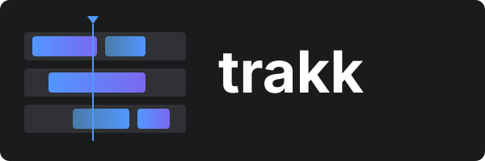

<p align="center">
  
</p>

<p align="center">
  <strong>Lightweight timeline editor web component</strong><br>
  Zero dependencies. Works everywhere.
</p>

<p align="center">
  <a href="#installation">Installation</a> •
  <a href="#usage">Usage</a> •
  <a href="#api">API</a> •
  <a href="#events">Events</a> •
  <a href="#demo">Demo</a>
</p>

---

## What is it?

A timeline editor for building animation tools, video editors, audio sequencers, or anything that needs time-based sequencing. Built as a native Web Component with zero dependencies.

## Installation

```bash
npm install trakk
```

Or use directly via CDN:

```html
<script type="module" src="https://unpkg.com/trakk/dist/trakk.esm.js"></script>
<link rel="stylesheet" href="https://unpkg.com/trakk/dist/trakk.css">
```

## Usage

```html
<trakk-editor id="timeline"></trakk-editor>

<script type="module">
  import { Trakk } from 'trakk';
  import 'trakk/css';

  const timeline = document.getElementById('timeline');

  timeline.setData([
    {
      id: 'track-1',
      name: 'Audio',
      blocks: [
        { id: 'block-1', name: 'Intro', start: 0, end: 5 },
        { id: 'block-2', name: 'Main', start: 6, end: 15 }
      ]
    },
    {
      id: 'track-2',
      name: 'Video',
      blocks: [
        { id: 'block-3', name: 'Scene 1', start: 0, end: 10 }
      ]
    }
  ]);

  // Play/pause
  timeline.play({ autoEnd: true });
  timeline.pause();

  // Listen for changes
  timeline.addEventListener('change', (e) => {
    console.log('Updated:', e.detail.tracks);
  });
</script>
```

## API

### Methods

| Method | Description |
|--------|-------------|
| `setData(tracks)` | Set timeline data |
| `play(options?)` | Start playback. Options: `{ autoEnd: boolean, toTime: number }` |
| `pause()` | Pause playback |
| `setTime(time)` | Set current time position |
| `getTime()` | Get current time |
| `getTotalTime()` | Get total duration (end of last block) |
| `setConfig(config)` | Update configuration |
| `saveToLocalStorage(key?)` | Save to localStorage |
| `loadFromLocalStorage(key?)` | Load from localStorage |

### Configuration

```javascript
timeline.setConfig({
  scale: 1,              // Seconds per scale unit
  scaleWidth: 160,       // Pixels per scale unit
  scaleCount: 20,        // Number of scale units
  startLeft: 100,        // Left margin (label column width)
  rowHeight: 32,         // Track height in pixels
  autoScroll: true,      // Auto-scroll during playback
  hideCursor: false,     // Hide playhead cursor
  disableDrag: false     // Disable all dragging
});
```

### Data Structure

```typescript
interface Track {
  id: string;
  name?: string;
  locked?: boolean;      // Prevent editing
  blocks: Block[];
}

interface Block {
  id: string;
  name?: string;
  start: number;         // Start time in seconds
  end: number;           // End time in seconds
  locked?: boolean;      // Prevent editing this block
}
```

## Events

```javascript
// Data changed (drag, resize, create, delete)
timeline.addEventListener('change', (e) => {
  console.log(e.detail.tracks);
});

// New block created via drag
timeline.addEventListener('itemcreated', (e) => {
  console.log(e.detail.item, e.detail.row);
});

// Block deleted
timeline.addEventListener('blockdeleted', (e) => {
  console.log(e.detail.block, e.detail.track);
});

// Track deleted
timeline.addEventListener('trackdeleted', (e) => {
  console.log(e.detail.track);
});

// Track/block renamed (double-click to edit)
timeline.addEventListener('trackrenamed', (e) => {
  console.log(e.detail.track, e.detail.name);
});

timeline.addEventListener('blockrenamed', (e) => {
  console.log(e.detail.block, e.detail.name);
});
```

### Engine Events

Access the playback engine directly:

```javascript
timeline.engine.on('play', () => console.log('Playing'));
timeline.engine.on('paused', () => console.log('Paused'));
timeline.engine.on('ended', () => console.log('Ended'));

timeline.engine.on('setTimeByTick', ({ time }) => {
  // Called every frame during playback
  console.log('Current time:', time);
});
```

## Callbacks

For advanced control over interactions:

```javascript
timeline.setCallbacks({
  // Custom rendering
  getActionRender: (block, track) => `<b>${block.name}</b>`,
  getScaleRender: (time) => `${time.toFixed(1)}s`,

  // Interaction hooks (return false to cancel)
  onActionMoving: ({ action, start, end }) => {
    if (start < 0) return false; // Prevent moving before 0
  },
  onActionResizing: ({ action, start, end }) => {
    if (end - start < 0.5) return false; // Minimum 0.5s duration
  },

  // Click handlers
  onClickAction: (e, { action, row, time }) => {},
  onDoubleClickAction: (e, { action, row }) => {},
  onClickRow: (e, { row, time }) => {},
  onClickTimeArea: (e, { time }) => {}
});
```

## Demo

Open `demo.html` in a browser or check out the [live demo](https://sidcom-ab.github.io/trakk).

## License

MIT
